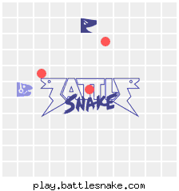

# battlesnake
Battlesnake instructions and code using Python

---

# Project Information

The project of [battlesnake](https://play.battlesnake.com/) has been made for the [Open Tech Summit 2021](https://www.opentechsummit.info/) conducted by IIIT Hyderabad (OSDG Group)

**Battlesnake Deployment URL :** https://battlesnake-one.vercel.app/

**Battlesnake Profile :** https://play.battlesnake.com/u/dvishal485/alpha/

```
Software Engineering
Track 5

A 3-day Battlesnake event where devs get to program their
snakes to compete with each other and climb up the ladder.
Here’s the kicker: they must also defeat OSDG’s snake to
qualify for the final phase!
```

- Team Name : `Alpha`

- Team Member : [`@dvishal485`](https://github.com/dvishal485) (Solo Team)

- I assure no plagiarism has been done and the concept and code is completely mine. Only the information from [official battlesnake github](https://github.com/BattlesnakeOfficial/starter-snake-python) have been used to initialize the project.

- [Beating the OSDG's Snake](https://play.battlesnake.com/g/f4f21e36-ea4c-41a2-ac99-52313fe9c34d/) (qualification to final phase)

    

- Ranked `3rd` in the event 💯

---

# Mechanism & Working
1. The board information received from battlesnake is translated into a `numpy` array/matrix containg the gain and loss to be experienced at every coordinate of board.
1. The board around the head of our battlesnake is captured in a `3x3` matrix.
1. All the moves `up`, `down`, `right` and `left` are evaluated and the moves with minimum risk / maximum profit are selected.
1. The moves are further evaluated by considering the next moves possible, and hence further the moves which are most favorable are selected.
1. If still there are multiple possible moves possible, then a random move is selected.

---

# License & Copyright

  - This Project is [Apache-2.0](./LICENSE) Licensed
  - Copyright 2021 [Vishal Das](https://github.com/dvishal485)
